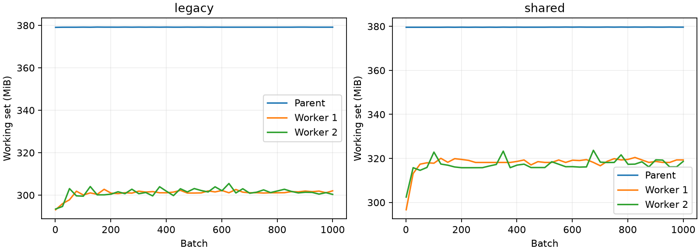

# S2：数据语义与共享存储成本

后续决定：用户选择不扩数，采用明确标注的采样功率均值代理，并修正现有卫星数据。
见 [ADR-007](adr/007-compact-development-route.md)。下文的扩容门禁仍适用于将来的大规模构建，
不阻止当前规模的开发验证。

日期：2026-09-28。状态：有界工程实现、源审计和基准完成；大规模构建门未通过。
分支：codex/s2-data-semantics-storage。旧数据与运行产物未改写，未启动 S3 扩数。

## 1. 结论与审核事项

共享存储对当前紧凑区域有明显收益：两天窗口的卫星存储减少 94.56%，热缓存吞吐达到
662 samples/s。S2 同时发现并修正了 Meteosat sweep 轴错误。

进入 S3 前仍需确认标签的时间支持：固定版本数据卡称 5 分钟数据为瞬时观测，不能将其三点均值
直接宣称为真实 15 分钟区间平均功率。推荐明确采用“采样功率均值代理”并更新协议；若必须预测
真实区间能量，应使用半小时积分数据另定目标。详见 [ADR-006](adr/006-data-semantics-geolocation-and-shared-tiles.md)，
其中已备好上游询问草稿，未对外发送。

## 2. 数据语义与空间审计

固定 revision 的数据卡与原始 Parquet 均已核对并保存哈希。20 站点两天的 11,373 条五分钟读数
重建出 3,770 个完整对照 bin，与旧数据数值完全一致。单独取得约 20.58 MB 的同 revision
半小时分区做尺度交叉验证：1,874 个完整配对 bin，其中 431 个积分功率超过 1% 容量；
日间归一化 MAE 0.007787、bias −0.002036、代理/积分能量总量比 0.98249。
这些结果支持换算尺度，不足以确认积分时间支持。

投影已改为 sweep=y，与源 geos metadata 的默认值一致。五站点的原裁剪中心到模糊站点坐标的距离
为 5.19–7.89 km；修正后的最近网格中心距离为 0.69–3.30 km。该纬度的相邻网格地面距离
约东西 3.32 km、南北 6.41–6.42 km，不能把标称 3 km 当成英国地区的各向同性地面分辨率。
五站点历史裁剪与源归档按历史索引读取完全一致，说明旧存储可重现，但不消除原中心偏移。

VIS006/IR_016 为反射率通道，IR_108 为亮温；源 attrs 单位分别为 %/%/K。
归档年度 attrs 的扫描时间只描述年初样例，不能代表所有帧。当前 observation_time 使用归档坐标，
实际逐像素扫描和发布时刻未提供。[机器审计](audits/s2-data-audit-2026-09-28.json)

## 3. 可用时间情景

新增显式 observation_time / available_time 契约，区分 scenario 与实测；缺乏发布记录时拒绝伪装为 measured。
在前两天 185 个 issue 时刻上执行精确历史槽回放：

| 假设卫星延迟 | 四帧完整的 issue 数 | 缺失槽数 |
|---|---:|---:|
| 0 分钟 | 185 | 0 |
| 15 分钟 | 184 | 1 |
| 30 分钟 | 183 | 3 |

减少来自窗口开头缺少更早历史，不能解读成全国或全季节可用率。这是输入可用性回放，
没有模型精度评分；功率发布延迟也未测得。正式延迟精度回测留待目标契约确定及模型对照阶段，
当前不能宣称实时预测能力。

## 4. 共享 tile 与一致性

布局定义及迁移约束见 [SHARED_TILE_SCHEMA](SHARED_TILE_SCHEMA.md)。两天窗口包含 20 站点、
192 个 15 分钟时刻，原始逐站点像素为 327,680 个空间像素位置，实际并集仅 17,154。
使用 4 个 128² 网格 tile，边缘未覆盖位置保留空间 mask 与 NaN，不把它们当作观测。

全部 3,840 帧逐像素一致，通道顺序、缺帧、统计量一致；合成测试另验证跨 tile halo、
冲突重叠拒绝、未完成目录拒绝，以及模型输入和目标完全一致。

| 存储/构建项 | 实测 |
|---|---:|
| 原布局所需压缩帧 chunks（不含元数据） | 169,851,387 bytes |
| 共享布局全部文件（含元数据） | 9,233,383 bytes |
| 相对减少 | 94.56% |
| 迁移耗时 | 4.52 秒 |
| 额外全量临时副本 | 0；旧数据保留，新目录为最终输出 |
| 本地迁移网络流量 | 0 |

该窗口对应 196 个远程源 objects、249,895,341 bytes 压缩载荷，计数来自已有源缓存清单。
另对其中一个 object 做独立 HTTP GET：1,202,166 bytes、3.18 秒，与缓存 SHA-256 一致。
未重复下载整个窗口，不能把单请求时延当作完整远程吞吐基准。
[网络探测](audits/s2-network-probe-2026-09-28.json)

## 5. 加载吞吐与内存

Windows、Torch 2.14.0+cpu、2 workers、batch size 8、预取 2，比较同样的 3,553 个样本。
每种布局都完成 1,000 batches、7,986 次样本读取，无死锁；数据不足一千批时重启迭代器，
因此这是跨 epoch 读取，不是 7,986 个独立样本。

| 指标 | 原布局 | 共享布局 |
|---|---:|---:|
| 首轮吞吐（含 worker 启动） | 378.4 samples/s | 534.8 samples/s |
| 首轮 P95 batch 等待 | 37.54 ms | 27.84 ms |
| 热缓存吞吐 | 447.1 samples/s | 662.1 samples/s |
| 热缓存 P95 batch 等待 | 36.86 ms | 25.78 ms |
| 父进程与两 worker 合计峰值 working set | 985.7 MiB | 1,021.5 MiB |
| 后半程合计 RSS 波动范围 | 4.58 MiB | 7.87 MiB |

共享缓存以约 36 MiB 总进程工作集增量换取读取效率。后半程斜率分别约 −4.28 KB/batch 和
+2.58 KB/batch，共享版拟合增量约 1.29 MB，低于同期波动；本次未观察到明显持续累积。
这是短窗口证据，不能代替数小时训练的内存测试。

首轮是新建加载器、清空应用缓存；未清除操作系统文件缓存，所以不称为严格磁盘冷缓存。
热缓存超过 50 samples/s 的目标。完整时序保存在
[基准 JSON](audits/s2-storage-benchmark-2026-09-28.json)。



## 6. 年度与磁盘预算

采用十进制 GB。以下为当前两天冬季压缩率、相同区域面积和采样频率的线性情景估算，
不是全年实测。区域数须由未来站点实际 tile 并集计算，不能仅由站点数决定。

| 等效紧凑区域数 | 年度共享卫星 | 压缩变差 2 倍 | 全年源 chunk 缓存 |
|---|---:|---:|---:|
| 1 | 1.69 GB | 3.37 GB | 44.59 GB |
| 4 | 6.74 GB | 13.48 GB | 178.35 GB |
| 15（假设每区 20 站） | 25.28 GB | 50.55 GB | 668.83 GB |
| 300（每站独立占等效区域的压力情景） | 505.53 GB | 1,011.06 GB | 13,376.60 GB |

派生卫星的 300 GB 目标对紧凑区域可行，对分散站点没有保证；标签、索引、坐标和版本档案另计。
源缓存必须有上限，不能把全部年度 11 通道源 chunk 长期留盘。当前源缓存为 3.665 GB。

测量盘总量 666.52 GB、剩余 145.57 GB；保留整盘 20%（133.30 GB）后，可新增约 12.27 GB。
一个候选“小步扩容”预算为四区域、四个 30 天月份：共享卫星 2.22 GB、压缩敏感性 4.43 GB；
源缓存上限 4 GB、临时工作区 1 GB、权重 1 GB，总计 8.22–10.43 GB，再加标签和索引。
这仅是预算草案，不能授权全年构建，开始前必须重新检查可用磁盘。
[预算计算记录](audits/s2-storage-budget-2026-09-28.json)

现有构建器仍先产出站点裁剪，再做共享迁移，且源缓存尚未实现淘汰。因此目前不能按上述
4 GB 缓存草案直接扩数；需要分区域/时间窗口构建、验证后淘汰源缓存，或直接从源写共享 tile。

## 7. 来源与许可边界

UK PV 固定数据卡列出 CC-BY-4.0，文件访问需接受上游条件；本次使用已配置的访问凭据，仅保留
本地数据和可复核摘要。[UK PV 数据卡](https://huggingface.co/datasets/openclimatefix/uk_pv/blob/02f17566e1b1a56dc8fd25cfabec67f065066e07/README.md)

卫星云桶可读取并不等于已核清再分发许可。EUMETSAT 数据政策区分产品及许可条件；OCF 这个
v4 派生归档的许可映射仍需确认。因此只交付代码和统计摘要，不发布原始 tile。
[EUMETSAT 数据政策入口](https://www.eumetsat.int/legal-framework/data-policy)

## 8. 验收与下一步

Ruff 通过；完整测试 102 passed、1 skipped（CUDA unavailable），53.43 秒。
新增 8 项 S2 用例。复现命令（输出与 basetemp 须为尚不存在的新目录）：

```bash
python -m scripts.audit_s2_data --output outputs/s2-audit-new
python -m scripts.benchmark_shared_tiles --output outputs/s2-storage-new --frames 192 --batches 1000 --workers 2
python -m ruff check src scripts tests
python -m pytest --basetemp=outputs/pytest-s2-new --tb=short -ra
```

审计脚本依赖本机已有 UK PV 探测记录和缓存；半小时交叉核对与单 object 网络探测是额外有界审计，
其固定文件路径、哈希、窗口和算法在 JSON/ADR 中留存。

S2 工程交付可审核；进入 S3 的门仍关闭。下一步先确认采样均值代理或真实积分目标，
再落实有上限的分块构建，核验新投影裁剪，并按实际地域重新测算成本。协议更新前不扩全年数据。
